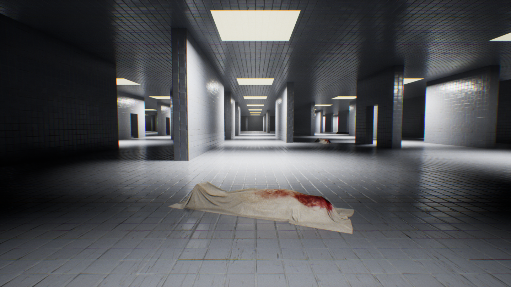

---
# Layout e SEO
layout: default
title: Gustavo 'TurkowLoKo' Bolanho - Technical Artist & Game Developer
description: Portfolio of Gustavo 'TurkowLoKo' Bolanho, a Technical Artist and Game Developer based in São Paulo - Brazil, showcasing the solo development of "Sanatorio" (UE5), past projects, and a versatile skill set bridging art and code. Available for relocation.
---

# Gustavo 'TurkowLoKo' Bolanho
<h3 style="text-align: center;">Technical Artist & Game Developer</h3>

## About Me

Hi, I'm Gustavo! My journey into game development began with a deep love for **programming**, spanning over two decades since I started coding at age 12 with VB.NET and the .NET framework. This strong coding foundation naturally led me to C# and engines like Unity. My passion for not just building game systems but also for crafting the visual and interactive elements themselves guided me to become a **Technical Artist**. I thrive on bridging the gap between art and code, developing tools, pipelines, shaders, and VFX, while also engaging in modeling, animation, and overall visual creation. My experience with Linux (Debian-based) since 2010 also shapes my development approach.

I am fluent in **English** and my native **Portuguese**, with intermediate proficiency in **Spanish** and basic knowledge of **French**. Currently based near São Paulo - **Brazil**, I am open and available for relocation opportunities.

My current endeavor, the solo development of the horror game "Sanatorio" in UE5, is where I synthesize all these skills – from core programming to detailed artistic execution.

---
---

## Sanatorio: The Current Solo Endeavor (UE5)

{:class="sanatorio-logo"}

"Sanatorio" is more than just a game project for me; it's the **central focus of my current creative and technical efforts**, a deeply personal endeavor where I'm channeling years of accumulated knowledge. Revisiting this concept, which first sparked my passion for game development, I am now meticulously crafting its modern incarnation using **Unreal Engine 5**. This is a solo mission: I've transformed my room into a dedicated development studio, pouring 10-12 hours daily into every facet of "Sanatorio"—from programming complex systems and designing intricate gameplay mechanics to modeling environments, creating characters, animating, and implementing visual effects.

This intense dedication is fueled by a profound passion to realize a singular vision. For me, working on "Sanatorio" is also a vital means of achieving mental balance and constructively channeling my creative drive. My objective is to build a compelling, polished, and immersive horror experience that not only stands as a testament to my capabilities as a solo developer but also resonates deeply with players. I am leveraging the full spectrum of my skills as a programmer, generalist artist, and animator to bring this world to life.

**Dive Deeper into Sanatorio's Development:**

*   **Technical Insights & Progress:** [Sanatorio on IndieDB](https://indiedb.com/games/sanatorio)
*   **Visual Glimpses (Work in Progress):**
    

    
    
    
    

---
---

## My Journey & Past Projects: Building the Foundation

The projects below represent key milestones in my learning and skill development, each contributing to the expertise I now pour into "Sanatorio."

### The Early Days: Foundations in Programming (Pre-2011)

My programming journey began with **VB.NET (Basic)** and the **.NET universe**, pivotal for my later work with C# in game engines.

-   **Circa 2008: 3D Game Studio & Lite-C**
    -   First game engine experience, learning scripting with **Lite-C**.
-   **DarkBasic:** Early framework bridging Basic with OpenGL.

### 2011: The Unity Awakening - "Sanatorio" (The Original Spark)

Discovering **Unity (v2.5)** during my Computer Science studies ignited a passion.

-   **Project: "Sanatorio" (3D Horror FPS - Original Version)**
    -   Primary learning ground for **Transforms, Quaternions, Vectors** using C#.
    -   Implemented 3D character physics, inventory, and weapon switching from scratch.
    -   An incredible lesson in **resilience** and self-driven learning.
    -   **Showcase (Original 2011 Version):**
        -   
        

            <iframe src="https://player.vimeo.com/video/17611817?badge=0&autopause=0&player_id=0&app_id=58479" frameborder="0" allow="autoplay; fullscreen; picture-in-picture; clipboard-write; encrypted-media" title="Sanatorio beta"></iframe>
        

### Venturing into UDK & Unreal Engine 4

Exploration of the **Unreal Development Kit (UDK)** with **Kismet** deepened my visual programming skills. The shift to **UE4** was a game-changer, allowing me to dive into:

-   **Shader Programming & Environment Art:** Recreated a classic game map, learning lighting and shaders.
-   **Hackathon & Professional Experience (Chile):** Worked at an indie studio creating educational experiences in UE4.
-   **FPS Project for BGS 2016 (Brazil):** Programmer for an FPS showcased at Brasil Game Show.
    -   **Showcase:**
        -   
        *(Previously linked video is no longer available)*
-   **Niagara VFX:** Developed robust visual effects with Unreal's Niagara system.
    -   **Showcase (Gore VFX):**
        -   
        -   *(Link to Reddit post: [My first attempt to create gore VFX in Niagara](https://www.reddit.com/r/unrealengine/comments/el3q15/my_first_attempt_to_create_gore_vfx_in_niagara/))*

### Mastering Unreal Engine 5

**UE5** marked a new level of professional output with the following projects:

-   **Project: "Kurumin" (Ambitious Indie Game - UE5)**
    -   Full development workflow: Blender (modeling, texturing, rigging, animation) & UE5 (animation/gameplay programming with Metahumans).
    -   **Showcase:**
        

        
        
        
        

        -   [WIP - Kurumin: Indie Workflow with Metahumans and UE5 (UE Forums)](https://forums.unrealengine.com/t/wip-kurumin-my-indie-workflow-with-metahumans-and-ue5/512685)
        -   Kurumin Devlog Playlist:
        

            <iframe width="560" height="315" src="https://www.youtube.com/embed/videoseries?list=PL8UTE4vASGJusTj80VZpIWWC_77uqntiV" title="YouTube video player" frameborder="0" allow="accelerometer; autoplay; clipboard-write; encrypted-media; gyroscope; picture-in-picture; web-share" allowfullscreen></iframe>
        

-   **Project: "BRABO" (Tech Showcase - UE5)**
    -   Tutorial-focused project using Lumen, Nanite, & PCG.
    -   **Showcase:**
        

        
        
        
        

        -   BRABO Devlog Playlist:
        

            <iframe width="560" height="315" src="https://www.youtube.com/embed/videoseries?list=PL8UTE4vASGJsvkMIQIdtukKnkYzkpf-Cr" title="YouTube video player" frameborder="0" allow="accelerometer; autoplay; clipboard-write; encrypted-media; gyroscope; picture-in-picture; web-share" allowfullscreen></iframe>
        

---

## Explorations in Godot Engine & Mobile Development

My curiosity also led me to explore **Godot Engine**, particularly for its open-source nature and capabilities in 2D, 3D, and mobile development on Linux.

-   **"Potato Boom" & "Taxi Flight" (Android Games):** Explored GDScript, Java integration for Google Play Games SDK, procedural audio, and unique 2D-like rendering from 3D assets.
    -   **Potato Boom:**
        
        

            <iframe width="560" height="315" src="https://www.youtube.com/embed/QhM5Dqi3QC8" title="YouTube video player" frameborder="0" allow="accelerometer; autoplay; clipboard-write; encrypted-media; gyroscope; picture-in-picture; web-share" allowfullscreen></iframe>
        

        

            <iframe width="560" height="315" src="https://www.youtube.com/embed/kNpCl0Iv4BU" title="YouTube video player" frameborder="0" allow="accelerometer; autoplay; clipboard-write; encrypted-media; gyroscope; picture-in-picture; web-share" allowfullscreen></iframe>
        

    -   **Taxi Flight:**
        
        

            <iframe width="560" height="315" src="https://www.youtube.com/embed/Ny-8m5UZ0sw" title="YouTube video player" frameborder="0" allow="accelerometer; autoplay; clipboard-write; encrypted-media; gyroscope; picture-in-picture; web-share" allowfullscreen></iframe>
        

-   **"Project: Extractor" & "CS.EXE" (3D Studies in Godot):** Deep dived into Godot's 3D capabilities, GLTF workflow with Blender, GLSL shaders, storytelling with YarnSpinner, and third-party physics integration (Jolt Physics).
    -   **Project: Extractor:**
        

        
        
        

        

            <iframe width="560" height="315" src="https://www.youtube.com/embed/PIY6XN2tCqQ" title="YouTube video player" frameborder="0" allow="accelerometer; autoplay; clipboard-write; encrypted-media; gyroscope; picture-in-picture; web-share" allowfullscreen></iframe>
        

    -   **CS.EXE:**
        

        
        
        

        

            <iframe width="560" height="315" src="https://www.youtube.com/embed/JZ7JWlMzPqY" title="YouTube video player" frameborder="0" allow="accelerometer; autoplay; clipboard-write; encrypted-media; gyroscope; picture-in-picture; web-share" allowfullscreen></iframe>
        

        

            <iframe width="560" height="315" src="https://www.youtube.com/embed/niAXOqzixpk" title="YouTube video player" frameborder="0" allow="accelerometer; autoplay; clipboard-write; encrypted-media; gyroscope; picture-in-picture; web-share" allowfullscreen></iframe>
        

        
[More info on CS.EXE (Itch.io)](https://gbolanho.itch.io/csexe)

---
---

## The Generalist Advantage: Crafting "Sanatorio"

The diverse journey through various technologies and roles—from pure programming to 3D art and animation—has equipped me with a comprehensive **generalist skill set as a Technical Artist**. This breadth of experience is invaluable, especially for an ambitious solo project like "Sanatorio." It allows me to:

*   **Architect and Implement Robust Systems:** My programming foundation (C++, Blueprints, GDScript, C#) enables me to build complex gameplay mechanics, AI, and underlying game systems efficiently.
*   **Create Cohesive Visuals:** Skills in modeling (Blender), texturing, lighting, VFX (Niagara), and animation ensure that the artistic vision for "Sanatorio" is realized consistently. My explorations with Krita, GIMP, Inkscape, color theory, and animation principles further support this.
*   **Optimize the Entire Pipeline:** Understanding both the artistic and technical sides helps in creating efficient workflows and optimized assets, crucial for performance.
*   **Develop Custom Tools:** I can (and love to) create scripts and editor utilities to automate repetitive tasks and streamline the development process, making solo development more manageable.
*   **Solve Problems Holistically:** A generalist perspective means I can anticipate and resolve challenges that span multiple disciplines, ensuring smoother development.

This portfolio showcases the evolution of these skills, all of which are now being synthesized and pushed further in the creation of "Sanatorio."

---

## Broader Tech Stack & Software Engineering Skills

While "Sanatorio" and game development are my current prime focus, my love for programming extends to a wide array of technologies. My professional background is rooted in **.NET development for Windows**, and I've cultivated a strong preference for **Linux (Debian-based distributions)** since 2010 for my personal and professional projects whenever feasible.

I have significant experience as a **full-stack developer using Python with the Django framework**, having delivered and maintained websites for various clients, including an educational institution, a therapist, and a social project. This involved front-end work (HTML, CSS, JavaScript, Bootstrap) and back-end logic, database management (MySQL, PostgreSQL), and API integration. I've also worked with **Java (notably with Eclipse Scout)**. These experiences have provided me with a solid foundation in web technologies, database architecture, and delivering complete software solutions. My later dive into Godot projects also spurred a deeper engagement with open-source digital art tools like **Krita, GIMP, Blender, and Inkscape**, complementing my technical skills with a growing artistic toolkit.

### Visualized Tech Stack:

  
  
  
  
  
  
  
  
  
  
  
  
  
  
  
  
  
  
  
  
  
  
  
  
  
  
  
  

---

## Connect & Follow the Journey

-   **Email:** [jdmapas@gmail.com](mailto:jdmapas@gmail.com)
-   **GitHub (Personal Contributions):** [gbolanho](https://github.com/gbolanho)
-   **GitHub (TurkowLoKo - Sanatorio & Projects):** [turkowloko](https://github.com/turkowloko)
-   **Twitter/X (Updates & Musings):** [@gustavobolanho](https://x.com/gustavobolanho)
<!-- Adicione outros links relevantes se tiver (ex: Itch.io geral, ArtStation) -->

---